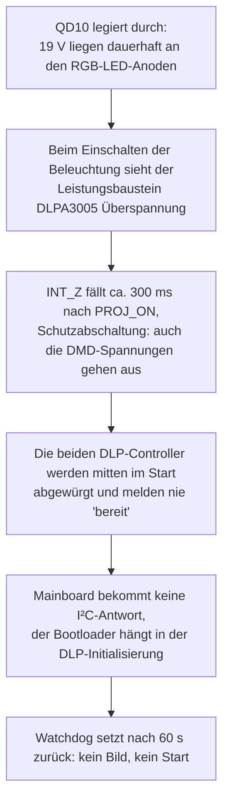
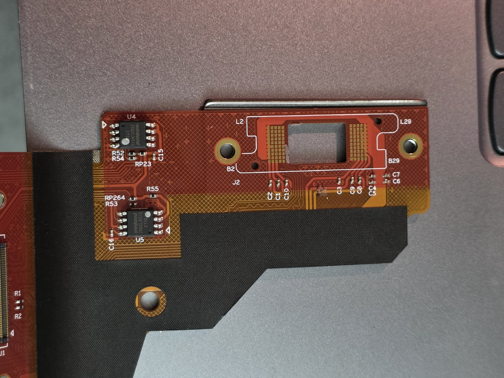
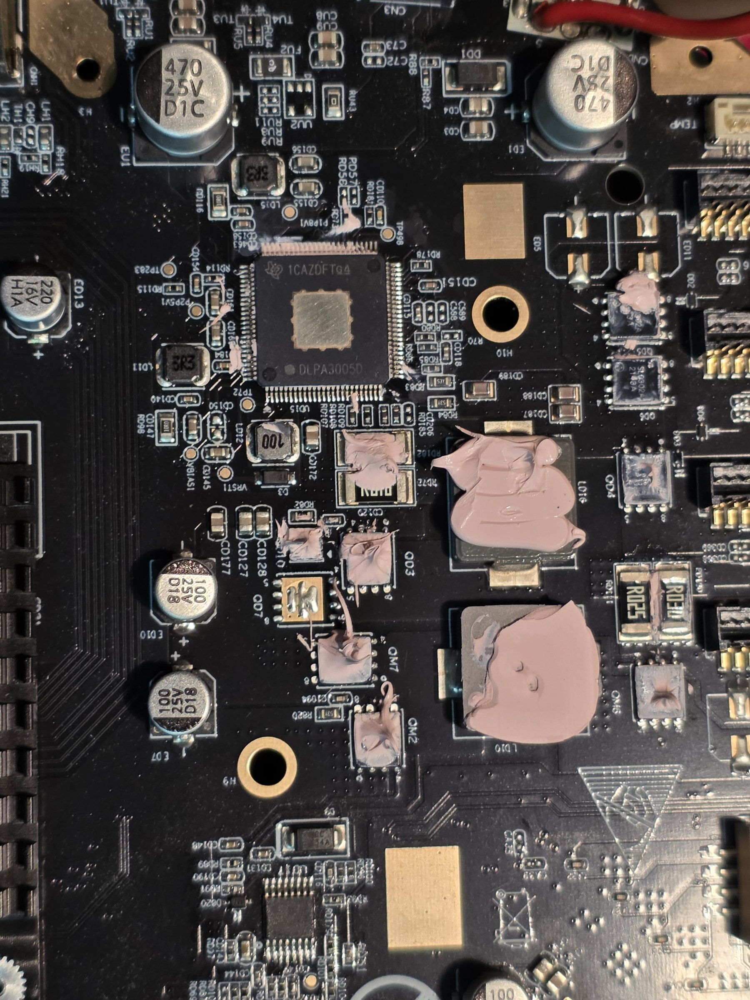
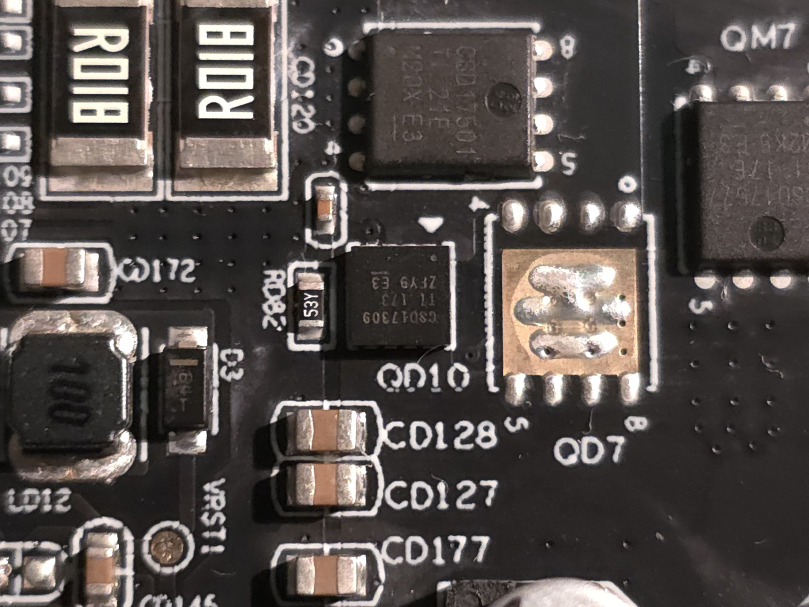

# XGIMI Horizon (XK03K): kein Start, kein Bild – Ursache gefunden

Dokumentation einer Reparatur: Messwerte, Bootlogs, Fotos und Werkzeuge.
Das Gerät startete nicht mehr. Ursache war **ein einziger kurzgeschlossener Leistungstransistor
(`QD10`) im RGB-LED-Treiber auf dem Mainboard**. Nach dem Ersatz lief der Projektor wieder vollständig.

> Das ist eine Privatreparatur, keine Herstellerinformation. Alles hier wurde an einem einzelnen
> Gerät beobachtet. Wo etwas Vermutung oder Deutung ist, steht es dabei.
> XGIMI ist nicht beteiligt. Nachbau und Eingriffe auf eigene Gefahr (siehe [Hinweise](#hinweise)).

## Kurzfassung

| | |
|---|---|
| Gerät | XGIMI Horizon (FHD), Modell XK03K, im Bootlog als `AG222` bezeichnet |
| Plattform | MStar/MediaTek-SoC (Image-Kopf: `MT9612_CODE`), DLP-Chipsatz von Texas Instruments |
| Symptom | kein Bild, kein Ton, Standby-LED blinkt, Gerät zieht beim Einschalten ca. 300 mA statt hochzufahren |
| Ursache | `QD10` (oberer Schalttransistor des RGB-LED-Wandlers, Aufdruck `CSD17309`) war durchlegiert |
| Reparatur | Transistor ausgelötet und ersetzt |
| Dauer der Suche | ein langer Tag, davon der Großteil auf falschen Spuren (siehe [Lehren](#lehren)) |

## Die Fehlerkette

Der entscheidende Hinweis stand von Anfang an in den Messwerten: **an den RGB-LED-Anoden lagen
im Ruhezustand 18,8 V** (bei abgeschalteter Beleuchtung sollte dort nahe 0 V liegen). Er wurde erst spät richtig gedeutet.

## Wie man den Fehler an einem eigenen Gerät erkennt

Diese Prüfungen sind in dieser Reihenfolge schnell gemacht. Das Gerät dabei möglichst stromlos oder nur kurz einschalten.

| Prüfung | Befund beim defekten Gerät | Gesund wäre |
|---|---|---|
| Diodentest an `QD10` (Mainboard, neben dem DLPA3005) | 0 V in beiden Richtungen | ca. 0,5–0,6 V in einer Richtung, Sperrung in der anderen |
| Vergleich: Diodentest am baugleich beschalteten `QM7` | ca. 600 mV | – |
| Widerstand 19-V-Schiene ↔ Anodenseite eines RGB-LED-Steckers | ca. 1 Ω | hochohmig |
| Spannung an der RGB-Anode im Ruhezustand | 18,8 V | nahe 0 V |
| `INT_Z` (DLPA3005, Pin 58), Oszilloskop, getriggert auf `PROJ_ON` | High, fällt nach ca. 300 ms auf Low | bleibt High |
| LED-Spannung während der 300 ms | rampt gleichmäßig bis zur Eingangsspannung | bleibt bei wenigen Volt |
| `VOFS` (DLPA3005, Pin 98) mit aufgesetztem DMD | pulst ca. 240 ms auf 10 V, dann aus; `VBIAS` 18 V und `VRST` −14 V ebenfalls nur ca. 160 ms | bleiben stehen |

Die Konsolenausgabe (siehe unten) zeigt dasselbe Fehlerbild von der Softwareseite: `read 0xD4 retry` in
Serie, `DLP IIC Read Failed`, `Host IRQ check fail`, dann `Power_Off` / `Power_On` in Endlosschleife.

## Der Weg dorthin (Kurzform)

Die vollständige Reihenfolge aller Versuche, auch der Sackgassen, steht in der [Chronik](docs/chronik.md).

1. **Serielle Konsole finden.** Auf dem Mainboard sitzt ein vierpoliger Stecker mit der Beschriftung `Debug`
   (Platzhalter `J26`, Bauteilname `J5`). 115200 Baud, 8N1, 3,3 V-Pegel. Empfangen ging sofort,
   Senden zum Gerät hat der Bootloader nie angenommen (Ursache nicht geklärt).
2. **Normalen Start lesen.** Bootrom, DDR, Secure Boot, OP-TEE, U-Boot und eMMC laufen sauber. Nach dem
   Einstecken geht das Gerät mit `Power Down` in den Standby. Nach einem Tastendruck bricht die
   Ausgabe ab. Mit Zeitstempeln: **Reset immer nach genau 60,2 s.** Das deutet auf einen Watchdog, nicht auf Spannungseinbrüche.
3. **Stumme Konsole verstehen.** Das USB-Upgrade-Image enthält als Klartext-Skript am Dateianfang
   (die ersten 16 kB) die Befehle, die der Bootloader beim Flashen ausführt. Darin steht `setenv close_log yes`,
   deshalb ist die Konsole ab dem Kernelstart absichtlich still. Außerdem `WDT_ENABLE 1` (Watchdog an).
4. **USB-Recovery ans Laufen bringen.** Der Stick wurde erst gelesen, nachdem er von GPT auf **MBR**
   mit einer FAT32-Partition umgestellt war. Der Flash dauert bei einem langsamen Stick rund 16 Minuten und darf
   nicht unterbrochen werden. Danach läuft der Bootloader von August 2022 statt Oktober 2022.
5. **Konsole öffnen.** Mit [`tools/make_diag_image.py`](tools/make_diag_image.py) werden aus dem Original-Image zwei Zeilen
   geändert (`close_log no`, `loglevel 7`) und die Prüfsummen neu berechnet. Ein selbstgebautes Mini-Image (20 kB)
   wurde vom Bootloader nicht ausgeführt, das volle Image mit denselben Änderungen schon. Danach zeigt die Konsole
   den Start bis zur DLP-Abfrage. Hier liegt das erste klare Indiz: **der Start hängt an der DLP-Platine, nicht am Mainboard.**
6. **DLP-Platine untersuchen.** Zwei DLPC3439-Controller, versorgt (1,1 V, 1,8 V, 3,3 V), 24-MHz-Takt vorhanden,
   beide lesen einmal ihre Firmware aus zwei Winbond-W25Q32JV-Speichern auf dem **Flexboard** und melden trotzdem
   nie „bereit“ (`HOST_IRQ` bleibt High). Beide Speicher wurden ausgelesen: **identischer Inhalt**, sauber aufgebaut.
7. **Leistungsbaustein untersuchen.** Unter dem linken Kühlkörper sitzt der **DLPA3005D**. `PROJ_ON` kommt an,
   `RESET_Z` wird freigegeben, die Schaltregler 1,1 V und 1,8 V stimmen. Über SPI fragt der Controller die Kennung ab und
   bekommt `E3` zurück (aus Oszilloskop-Zeiten bei etwa 20 MHz gedeutet). `INT_Z` fällt nach 300 ms. VOFS pulst nur mit
   aufgesetztem DMD kurz, ohne DMD bleibt er stumm, weil der Controller den fehlenden DMD erkennt.
8. **LED-Treiber untersuchen.** LED-Spannung rampt bis zur Eingangsspannung, `INT_Z` fällt, wenn sie ankommt. Das ist laut
   DLPA3005-Datenblatt das Verhalten bei offenem LED-Kreis (Überspannungsschutz). Kein Lichtblitz war zu sehen.
   Diodentest an den Leistungstransistoren: `QD10` zeigte 0 V in beiden Richtungen. Ersatz, Gerät lief.

## Hardware-Überblick

| Platine / Baugruppe | Wichtige Bausteine (laut Aufdruck) |
|---|---|
| **Mainboard** `310-00885-002` | SoC (MStar/MediaTek), eMMC 29,12 GB, **TI DLPA3005D** (Netzteil/LED-Treiber für den DLP-Chipsatz), TI TPS92641 (`UD17`, eigener Regler für die Bp-LED), `SL0302A` (`QD4`, `QD6`, `QD5` als Farbschalter R/G/B), `QD10` = `CSD17309` und `QD3` = `CSD17501` (Wandlertransistoren RGB), `QM7`/`QM2` = `CSD17577` (Wandler Bp), Drosseln `LD16` (RGB) und `LD10` (Bp) |
| **DLP-Platine** `310-00844-003` | 2× **TI DLPC3439** (`UDPP1`, `UDPP2`), i-Chips `IP00C788` mit ESMT-Speicher `M15T1G1664A` (Trapezkorrektur), Oszillator `OSC2` 24 MHz, TI `CDCLVC1102` (`U2`, Taktverteiler), Stecker `TO MAIN`, `POWER`, `DMD`, `Debug` |
| **Flexboard** am DMD | DMD (vermutlich DLP4710, 0,47″ 1080p, passend zum DLPC3439) und die beiden Firmware-Speicher `U4`, `U5` (Winbond `25Q32JVSIQ`) |

Auf der DLP-Platine sind `U4`/`U5` ein zweites Mal als Bestückungsplätze vorgesehen, aber leer. `QD7` auf dem Mainboard
ist der leere Alternativplatz zu `QD10` (größeres Gehäuse). Das sind Bestückungsvarianten ab Werk.

### Datenblätter
- [DLPA3005 (TI)](https://www.ti.com/lit/ds/symlink/dlpa3005.pdf), vor allem Abschnitte 7.3.2.5 (Beleuchtungsüberwachung), 7.3.3 (Auswahl der externen Transistoren), 7.5 (SPI, Interrupt)
- [DLPC3439 (TI)](https://www.ti.com/lit/ds/symlink/dlpc3439.pdf) und [Programmierhandbuch DLPU035](https://www.ti.com/lit/pdf/dlpu035)
- [DLP4710 (TI)](https://www.ti.com/lit/ds/symlink/dlp4710.pdf)
- [CDCLVC1102 (TI)](https://www.ti.com/lit/ds/symlink/cdclvc1102.pdf)
- [CSD17309Q3 (TI)](https://www.ti.com/product/CSD17309Q3), [CSD17577Q5A (TI)](https://www.ti.com/document-viewer/CSD17577Q5A/datasheet)
- [W25Q32JV (Winbond, bei Mouser)](https://www.mouser.com/catalog/specsheets/Winbond%20Electronics%20Corporation_08-25-2025_W25Q32JV-M.pdf)

## Ersatz für den Transistor

Aus dem DLPA3005-Datenblatt (Abschnitt 7.3.3) für die beiden Wandlertransistoren des RGB-LED-Treibers:
N-Kanal, volles Durchschalten bei 5 V Gatespannung, Gateladung höchstens 20–30 nC, **direkte** Ansteuerung ohne
Zusatzschaltung. Beim oberen Transistor legt sein Einschaltwiderstand die Überstromgrenze fest
(Abschaltung bei 185 mV Spannungsabfall, also Grenzstrom = 185 mV ÷ RDS(on)). Ein Ersatz sollte also auch im
Widerstand nahe am Original liegen.

| | Original `CSD17309Q3` | Alternative `CSD17577Q5A` |
|---|---|---|
| Platz | `QD10` (3,3 × 3,3 mm) | `QD7` (5 × 6 mm, leer) |
| RDS(on) bei 4,5 V (max.) | 6,3 mΩ | 4,8 mΩ |
| Gateladung | 7,5 nC | 13 nC |

Nur einen der beiden Plätze bestücken. Beide liegen parallel. **Bei dieser Reparatur wurde der Original-Typ nicht
verbaut, sondern ein anderer N-Kanal-MOSFET im 5×6-mm-Gehäuse. Das Gerät lief damit.** Ein Dauerersatz mit einem der
beiden Typen aus der Tabelle ist die Empfehlung aus dem Datenblatt, aber nicht an diesem Gerät erprobt.

## Werkzeuge

| Datei | Zweck |
|---|---|
| [`tools/uartlog.ps1`](tools/uartlog.ps1) | PowerShell: liest die serielle Konsole mit, schreibt Rohdatei und Datei mit Zeitstempeln, kann optional Enter senden |
| [`tools/make_diag_image.py`](tools/make_diag_image.py) | baut aus dem Original-Upgrade-Image ein Diagnose-Image (offene Konsole), mit Selbstprüfung der Prüfsummen |
| [`tools/flash_auslesen_pi.sh`](tools/flash_auslesen_pi.sh) | liest die beiden SPI-Speicher mit einem Raspberry Pi und `flashrom` aus (nur lesend) |

`make_diag_image.py` wurde gegen ein Image geprüft, das nachweislich geflasht wurde: gleiche Eingabe, bytegleiche Ausgabe.

**Wichtig beim Flashen:** Das Image beschreibt **alle Partitionen** und setzt gespeicherte Einstellungen und Abgleichdaten zurück.
USB-Stick: MBR, eine FAT32-Partition, Datei im Hauptverzeichnis unter dem Originalnamen, USB-2.0-Port. Gerät im Standby,
Power-Taste am Gerät 5–7 s halten, bis der Lüfter hochdreht. Nicht unterbrechen.

## Was nicht in diesem Repository liegt

- **Die Firmware** (`XGIMI_XGIMIGALILEO_XK03K.bin`, 3 291 635 744 Bytes, SHA-256
  `60609A1BA15EEF72674A24E211932D45A0EC71252AFCAFECC4FD5EBF6780677A`, Bauzeit laut Kopf 2022-08-19) gehört XGIMI. Bezug über die
  [XGIMI-Support-Seite](https://global.xgimi.com/pages/horizon-support). Die Prüfsumme dient nur dem Vergleich.
- **Die Speicherabbilder der DLP-Flash-Bausteine.** Sie enthalten TI- und XGIMI-Software und vermutlich gerätespezifische Daten.
- Datenblätter. Sie sind oben verlinkt.

Fotos, Logs und Notizen wurden bereinigt: keine Standortdaten in den Fotos, Etiketten mit Codes unkenntlich gemacht,
Geräte- und Funkadressen sowie die Seriennummern aus den Logs entfernt (Platzhalter `<entfernt>`).

## Logs

Alle Mitschnitte der Debug-Konsole sind in `logs/`. Die Dateien mit `_zeit` tragen vorn die Sekunden seit Beginn des Mitschnitts.
Die Nummern haben Lücken, weil leere Mitschnitte weggelassen wurden.

| Datei | Zeigt |
|---|---|
| `01_passiv_ac_und_kurzdruck` | Start nach dem Einstecken bis `Power Down`, nach Tastendruck Neustart und Stille nach der eMMC-Meldung |
| `02_uboot_printenv` | Versuch, U-Boot per Enter anzuhalten: ohne Wirkung |
| `06_passiv` | drei Starts nacheinander |
| `07_passiv_zeit` | erste Zeitstempel: Reset nach genau 60 s |
| `08_enter_beim_tastendruck_zeit` | Dauer-Enter im Start: ohne Wirkung, wieder 60 s |
| `09_ohne_dlp_flachband_zeit` | Flachbandkabel zur DLP-Platine abgezogen: unverändert |
| `10_alles_ab_ohne_tastenmodul_zeit` | Peripherie abgezogen: unverändert |
| `11_nur_tastenmodul_zeit` | nur Tastenmodul angesteckt: wieder 60 s |
| `12_flashmodus_mbr_stick_zeit` | Upgrade-Modus mit MBR-Stick, nach ca. 16 min Neustart mit Bootloader von August 2022 |
| `13_erster_start_nach_flash_zeit` | erster Start nach dem Flash, Konsole noch stumm |
| `14_diagnose_image_zeit` | Test mit dem 20-kB-Diagnose-Image: ohne Wirkung |
| `15_voll_diagnose_flash_zeit` | Flash des vollen Diagnose-Images, danach offene Konsole bis zur DLP-Abfrage |
| `16_start_mit_offener_konsole_zeit` | Start mit offener Konsole: `read 0xD4 retry`, `DLP IIC Read Failed` |
| `17_enter_offene_konsole_zeit` | Dauer-Enter im Bootloader: ohne Wirkung; DLP-Fehler auch ohne DMD |
| `18_flex_dran_dmd_ab_zeit` | Flexboard mit den Speichern angesteckt, DMD abgenommen: unverändert |

`docs/anfangsnotizen_vor_ursachenfindung.md` enthält die Notizen vom Anfang. Vieles darin ist überholt.

## Fotos

Die Fotos in `fotos/` sind nach der Reihenfolge der Untersuchung nummeriert: Mainboard von beiden Seiten (02–08), Debug-Stecker
(09, 12, 13), DLP-Platine mit und ohne Abschirmung (10, 11, 14–17), Flexboard mit den Speichern (18), DLPA3005 und Umgebung
unter dem Kühlkörper (19–21), LED-Anschlüsse und Schalttransistoren (01, 22), Bp-Regler (23), RGB-Wandler (24–26).

## Lehren

- **Stille auf der Konsole heißt nicht „hängt“.** Die Firmware schaltet die Ausgabe absichtlich ab (`close_log`).
- **Zeitstempel im Mitschnitt** waren der Schlüssel zum Watchdog: dreimal exakt 60,2 s.
- **Bauteile nicht nach Lage zuordnen.** Mehrere Annahmen waren falsch: Transistoren neben dem Debug-Stecker gehören zum Audio-Ausgang;
  der Taktverteiler `U2` verteilt nicht den Takt von `OSC2`; „gleiches Signal an zwei Pins“ war nur vertauschte Pinzählung.
- **Messgerät gegenprüfen.** Ein Multimeter zeigte rund 10 % zu viel an und täuschte kurz einen Fehler an den Schaltreglern vor.
- **Vergleichsmessung am baugleichen Bauteil** (`QM7` neben `QD10`) hat die Diagnose abgesichert.
- **Verpolt angeschlossene SPI-Klammer:** Der Winbond-Speicher hat es überlebt (kurz, danach dreimal identisch gelesen).
- **Bremsenreiniger greift die Vergütung der Linse an.** Optik beim Reinigen der Platinen abdecken oder ausbauen.
  Im Bild war der Schaden bei diesem Gerät nicht sichtbar.

## Hinweise

- Das Gerät wird mit einem 19-V-Netzteil betrieben. Die LED-Ströme sind hoch, die Spannungen am DMD reichen bis −14 V und +18 V.
  Falsches Einschalten kann Leistungsbausteine oder den DMD zerstören. Die Reihenfolge der DMD-Spannungen ist im DLPA3005-Datenblatt beschrieben.
- Beim ersten Einschalten nach einer Reparatur Kühlkörper montiert lassen, Lüfter angeschlossen, kurz einschalten.
- Ohne Gewähr. Wer nachbaut, tut das auf eigenes Risiko.
- XGIMI, Texas Instruments, Winbond, MediaTek und alle weiteren genannten Namen sind Marken ihrer Inhaber.

## Lizenz

Code in `tools/`: MIT ([`LICENSE`](LICENSE)). Text, Messwerte, Fotos und Logs: CC BY 4.0 ([`LICENSE-docs.md`](LICENSE-docs.md)).
